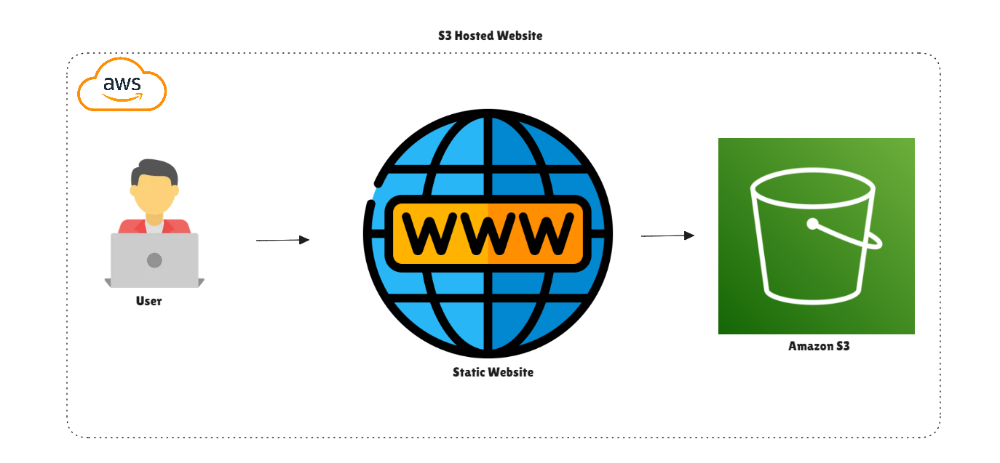
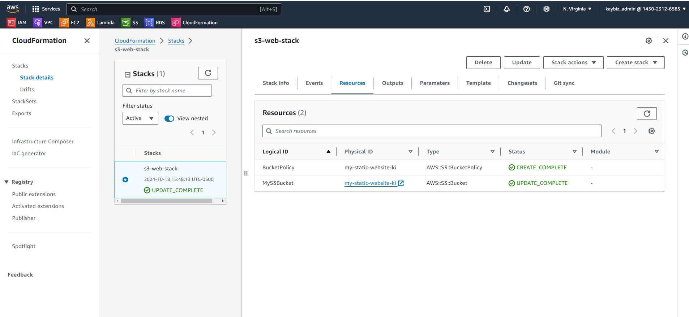
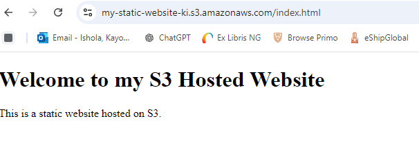

# S3 Static Website Hosting with CloudFormation

## Project Overview
This project demonstrates how to set up a static website using 
Amazon S3 and AWS CloudFormation. It includes steps for creating 
the S3 bucket, deploying a simple HTML file, and configuring the 
necessary permissions for public access.
<p></p>

## Prerequisites
- AWS CLI installed and configured
- Access to AWS Console
- A code editor (VS Code, Zed, etc.)

## Step-by-Step Guide

### 1. Create CloudFormation Template
1. Open your preferred code editor (VS Code, Zed, etc.).
2. Create a new file and name it `s3-static.yaml`.
3. Copy the following CloudFormation template into the file:

   ```yaml
   AWSTemplateFormatVersion: '2010-09-09'
   Description: 'CloudFormation template for S3 static website 
hosting'
   
   Resources:
     S3Bucket:
       Type: AWS::S3::Bucket 
       Properties:
         BucketName: my-static-website-ki 

         AccessControl: PublicRead
         WebsiteConfiguration:
           IndexDocument: index.html
           ErrorDocument: error.html
   
     BucketPolicy:
       Type: AWS::S3::BucketPolicy
       Properties:
         PolicyDocument:
           Id: MyPolicy
           Version: 2012-10-17
           Statement:
             - Sid: PublicReadForGetBucketObjects
               Effect: Allow
               Principal: '*'
               Action: 's3:GetObject'
               Resource: !Join 
                 - ''
                 - - 'arn:aws:s3:::'
                   - !Ref S3Bucket
                   - /*
         Bucket: !Ref S3Bucket
  

Here is my VSCode interface for reference:


Note: Replace my-static-website-ki with a globally unique bucket 
name. 

Save the file.

2. Deploy the CloudFormation Stack

Open your terminal.

Navigate to the directory containing your s3-static.yaml file.

Run the following AWS CLI command to create the stack:

aws cloudformation create-stack --stack-name my-static-website 
--template-body file://s3-static.yaml

Copy

Wait for the stack creation to complete. You can check the 
status in the AWS CloudFormation console.


Stack Deployment


3. Upload HTML File to S3 Bucket
Create a simple index.html file in the same directory as your 
CloudFormation template.

Use the AWS CLI to copy the HTML file to your S3 bucket:

aws s3 cp index.html s3://my-static-website-ki

Copy


Remember to replace my-static-website-ki with your actual bucket 
name.

4. View the Static Website
Navigate to the AWS S3 console.

Find your bucket and click on it.

Go to the "Properties" tab.

Scroll down to "Static website hosting" and click on the bucket 
website endpoint.

<p>After deploying the CloudFormation stack, you should see 
something like this in the AWS Console:
</p>
<p></p>

5. Troubleshooting Access Denied Error

<p>If you see an access denied error like this:

<p></p>

 follow these steps:

Go to the S3 console and select your bucket.

Click on the "Permissions" tab.

Under "Block public access (bucket settings)", click "Edit".

Uncheck "Block all public access" and save changes.

In the "Bucket policy" section, ensure that the policy allowing 
public read access is in place (this should have been created by 
the CloudFormation template).

Conclusion
You should now have a functioning static website hosted on 
Amazon S3:



Note: Welcome to my S3-hosted website is the text in my HTML. You 
can customize yours to suit your needs.

The CloudFormation template automates most of the 
setup, but remember to always be cautious with public access 
settings and only host content that is intended to be publicly 
accessible.

This setup creates a publicly readable S3 bucket. 
Ensure that you only upload content that is intended for public access. For 
more secure configurations, consider using Amazon CloudFront 
with your S3 bucket.


