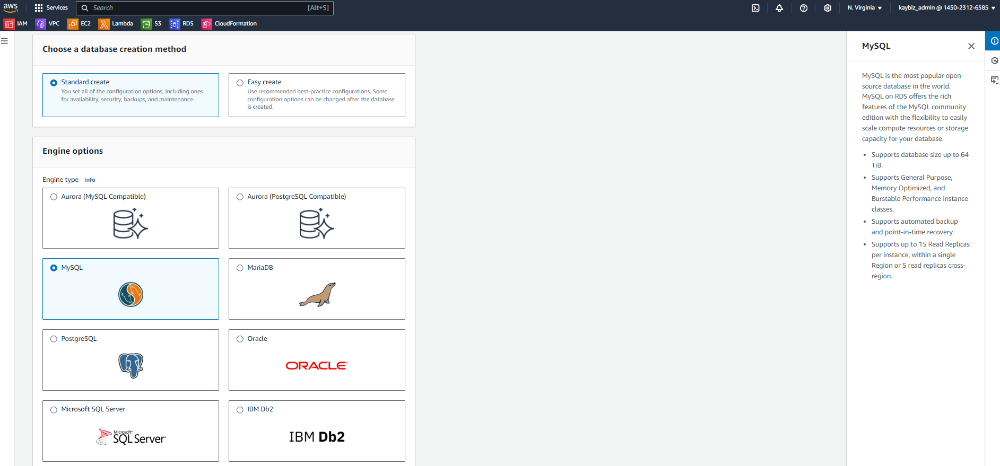
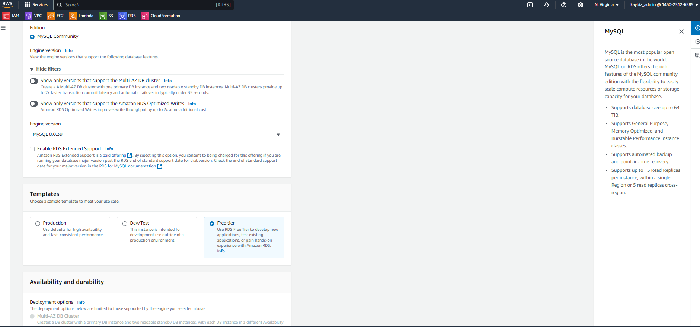
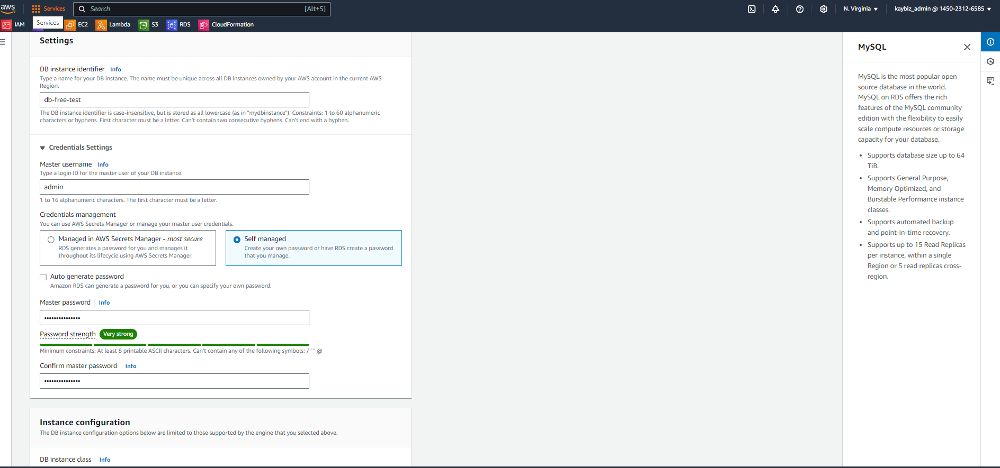
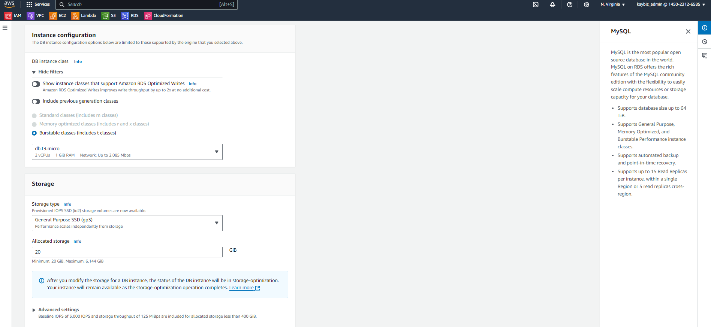
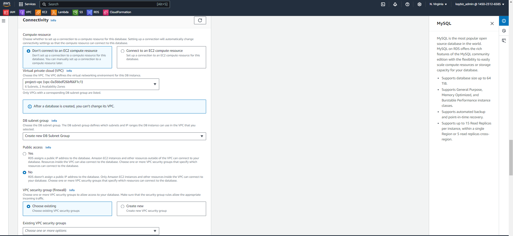
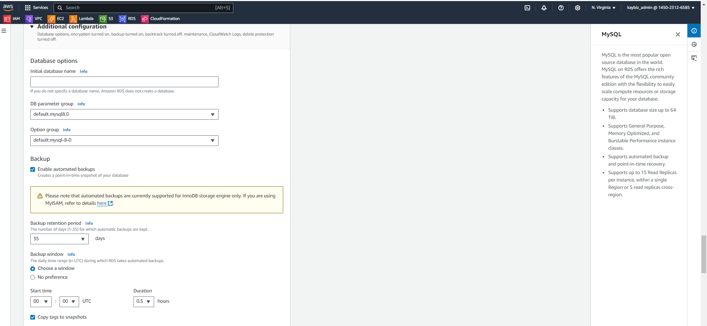
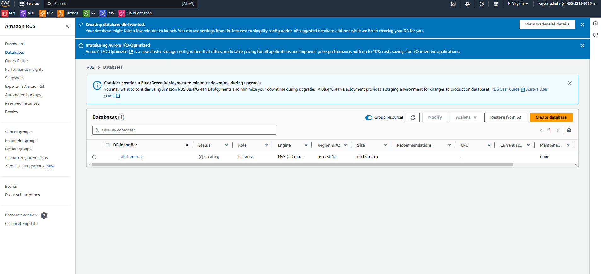

# My AWS RDS Database Creation Project

This README documents my hands-on project for creating a MySQL database using Amazon RDS (Relational Database Service) through the AWS console as part of my cloud engineering course.

## Project Overview

I created an RDS database using the AWS free tier option. This project helped me understand the process of setting up a cloud-based relational database.

## Steps I Followed

1. **Accessing RDS**
   - I logged into the AWS console and used the search bar to find RDS.

2. **Initiating Database Creation**
   - I navigated to Databases > Create Database.
   - I chose the Standard Create option for more control over the configuration.
   - 

3. **Configuring the Database**
   - I selected MySQL as the database engine.
   - I kept the default engine version (MySQL 8.0.39).
   - I chose the Free Tier template to stay within the free usage limits.
    -
   - I named my database 'db-free-test'.
   - I set up credentials with a username and password.

   - I selected the db.t3.micro instance class, which is part of the free tier.
   - I kept the default storage type as General Purpose SSD (gp3).

4. **Setting Up Connectivity**
   - I selected my project VPC named "Project-vpc".
   - I set Public Access to "No" for security reasons.
   - For the VPC Security Group, I chose an existing firewall setting.
   - I left the Availability Zone preference as "No preference".

5. **Additional Configurations**
   - I set the backup retention period to 35 days.
   - I chose a backup window during a time of expected low usage.

6. **Finalizing the Creation**
   - After reviewing all settings, I clicked "Create database".
   - I waited for the database to be created, which took a few minutes.

 - Once created, I accessed the database details to verify the configurations.

## Lessons Learned

Through this project, I gained practical experience in:
- Navigating the AWS console
- Understanding RDS configuration options
- Considering security aspects in database setup
- Working within free tier limitations

## Note

This project was completed using the AWS free tier, which limited some options but provided a cost-effective way to learn about RDS.

---

For anyone looking to replicate this project, please refer to the [official AWS RDS documentation](https://docs.aws.amazon.com/rds/) for the most up-to-date information and best practices.

