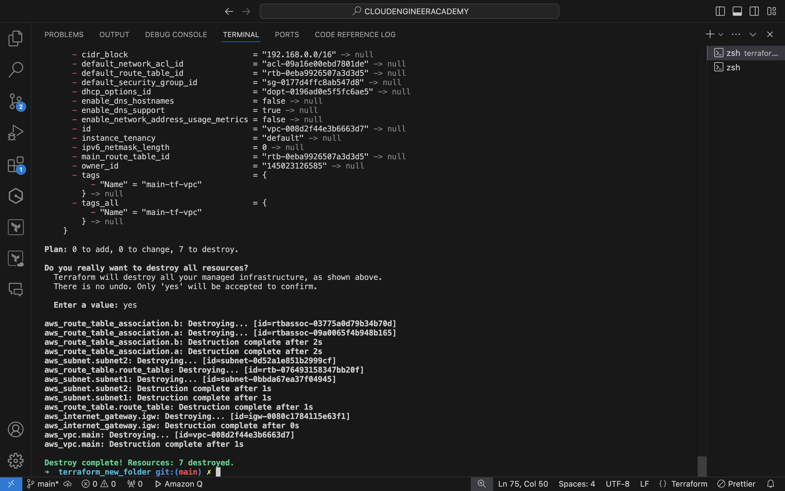

# AWS VPC Infrastructure with Terraform

This project creates a basic AWS network infrastructure using Terraform.

## Resources Created

- VPC
- 2 Subnets
- Internet Gateway
- Route Table
- 2 Route Table Associations

## Architecture Diagram

## Resource Details

### VPC
- CIDR Block: 192.168.0.0/16

### Subnets
1. Subnet 1
   - CIDR Block: 192.168.1.0/24
   - Availability Zone: us-east-1a
2. Subnet 2
   - CIDR Block: 192.168.2.0/24
   - Availability Zone: us-east-1b

### Route Table
- Routes:
  - Local route (auto-added)
  - 0.0.0.0/0 -> Internet Gateway

### Route Table Associations
- Subnet 1 and Subnet 2 associated with the route table

The above resources are shown in the image below. 

## The AWS console screenshot shows the VPC I created with terraform configurations.
- 
  
## Terraform Configuration and How to Use

Here is my terra VPC Configuration in VScode for your reference:
- 

Navigate to the Terraform project directory to see the configuration code:

The complete Terraform configuration for this VPC setup can be found in the <a href="https://github.com/Kaybiz/cloudengineeracademy/blob/main/cea-terraform/terraform_new_folder/main.tf">main.tf</a> file.

Key resources defined in this configuration include:

<ul>
<li>
VPC

</li><li>
Subnets

</li><li>
Internet Gateway

</li><li>
Route Table

</li><li>
Route Table Associations

</li></ul>

## Terraform Commands Used

Run terraform init to initialize Terraform

Run terraform plan to preview changes

Run terraform apply to create the infrastructure

The image below is my terminal results of the apply command.

## Cleaning Up
To destroy the created resources:

Run terraform destroy

Caution: This will remove all resources created by this Terraform 
configuration.

The infrastructure has been destroyed, but the <a href="https://github.com/Kaybiz/cloudengineeracademy/blob/main/cea-terraform/terraform_new_folder/main.tf">main.tf</a> file code remains as a reference for future use.

See the image below for the successful destruction of the VPC.

## Lessons Learned and Skills Gained

Through the process of creating this VPC infrastructure with Terraform, I have gained valuable experience and skills:

1. **Infrastructure as Code (IaC)**: Learned how to define and manage AWS infrastructure using Terraform, translating traditional manual processes into code.

2. **AWS Networking Concepts**: Deepened understanding of VPCs, subnets, internet gateways, and route tables, and how they interact to create a functional network architecture.

3. **Terraform Syntax and Structure**: Gained proficiency in writing Terraform configuration files, including resource blocks, variables, and outputs.

4. **Resource Dependencies**: Learned how to manage dependencies between different AWS resources in Terraform, ensuring proper order of resource creation and deletion.

5. **State Management**: Understood the importance of Terraform state and how it keeps track of the real-world resources.

6. **Modular Design**: Began to appreciate the benefits of creating modular and reusable Terraform configurations.

7. **Version Control Integration**: Improved skills in using Git for version-controlling infrastructure code, including committing changes and pushing to GitHub.

8. **Documentation**: Enhanced ability to write clear, concise documentation for infrastructure projects, making it easier for others (or future self) to understand and use the code.

9. **AWS CLI and Console**: Improved familiarity with AWS CLI commands and navigating the AWS Console to verify resource creation and management.

10. **Security Considerations**: Gained awareness of security best practices in VPC design, such as proper CIDR block allocation and the importance of security groups (though not implemented in this basic example).

11. **Troubleshooting**: Developed skills in debugging Terraform scripts and AWS resource issues, interpreting error messages, and finding solutions.

12. **Terraform Workflow**: Mastered the basic Terraform workflow of init, plan, apply, and destroy, understanding the purpose and importance of each step.

This project has been a significant step in my journey towards becoming proficient in cloud infrastructure automation and management.
