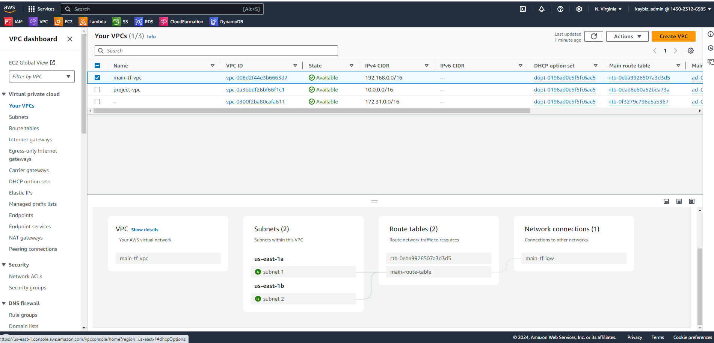
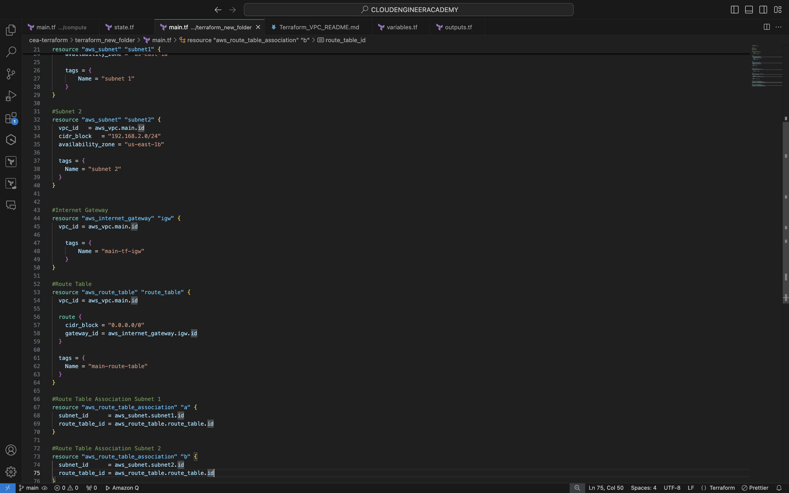
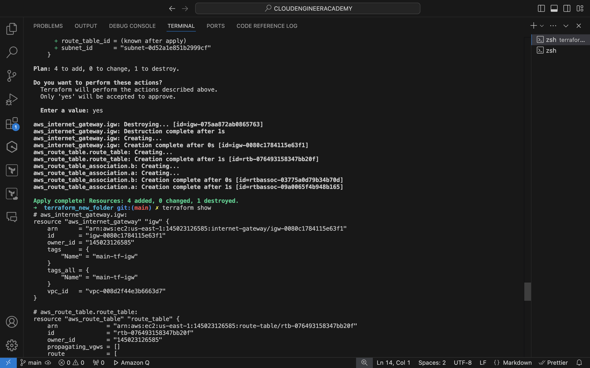

# AWS VPC Infrastructure with Terraform

This project creates a basic AWS network infrastructure using Terraform.

## Resources Created

- VPC
- 2 Subnets
- Internet Gateway
- Route Table
- 2 Route Table Associations

## Architecture Diagram

## Resource Details

### VPC
- CIDR Block: 192.168.0.0/16

### Subnets
1. Subnet 1
   - CIDR Block: 192.168.1.0/24
   - Availability Zone: us-east-1a
2. Subnet 2
   - CIDR Block: 192.168.2.0/24
   - Availability Zone: us-east-1b

### Route Table
- Routes:
  - Local route (auto-added)
  - 0.0.0.0/0 -> Internet Gateway

### Route Table Associations
- Subnet 1 and Subnet 2 associated with the route table

The above resources are shown in the image below. 

## The AWS console screenshot shows the VPC I created with terraform configurations.
- 
  
## Terraform Configuration and How to Use

Here is my terra VPC Configuration in VScode for your reference:
- 

Navigate to the Terraform project directory:

cd 
/cloudengineeracademy/cea-terraform/terraform_new_folder/main.tf

cea-terraform/terraform_new_folder/main.tf
Run terraform init to initialize Terraform

Run terraform plan to preview changes

Run terraform apply to create the infrastructure

The image below is my terminal results of the apply command.

## Cleaning Up
To destroy the created resources:

Run terraform destroy

Caution: This will remove all resources created by this Terraform 
configuration.

Project Location
The Terraform configuration files for this project are located in:
/Users/admin/Documents/CLOUDENGINEERACADEMY/cea-terraform/terraform_new_folder
