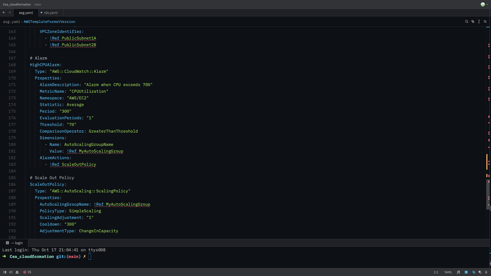
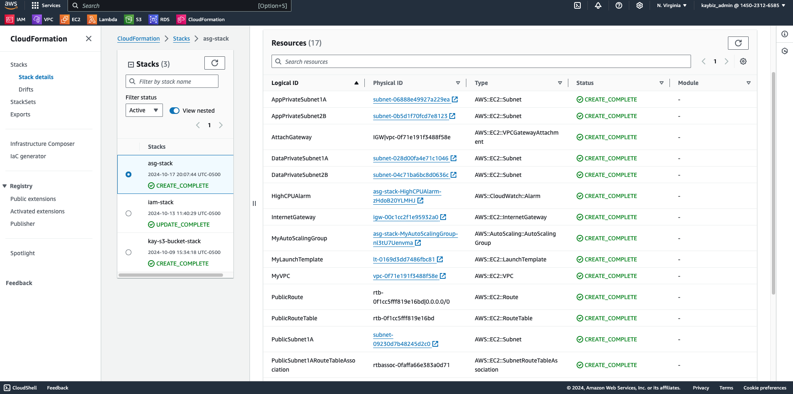

# AWS VPC and Auto Scaling Group Infrastructure

This project demonstrates the setup of a robust AWS infrastructure using CloudFormation, including a custom VPC, Auto Scaling Group, and associated components.
## Overview
This CloudFormation template creates a comprehensive AWS infrastructure designed for scalability and high availability. It includes a custom VPC with public and private subnets across two Availability Zones, an Auto Scaling Group for EC2 instances, and associated security and networking components.


## Features
- Custom VPC with public and private subnets
- Multi-AZ architecture for high availability
- Auto Scaling Group with dynamic scaling policies
- Application Load Balancer for traffic distribution
- CloudWatch alarms for monitoring and auto-scaling triggers
- Security groups for controlled access

## Technologies Used
- AWS CloudFormation
- Amazon VPC
- Amazon EC2 Auto Scaling
- Amazon CloudWatch
- AWS Systems Manager (for AMI management)

## Architecture
The infrastructure includes:
1. A VPC with CIDR block 172.16.0.0/16
2. Two public subnets and four private subnets across two AZs
3. Internet Gateway for public internet access
4. NAT Gateways for private subnet internet access
5. Auto Scaling Group with t2.micro instances
6. Application Load Balancer
7. CloudWatch alarms for scaling policies


## Setup and Deployment
1. Ensure you have AWS CLI configured with appropriate permissions.
2. Clone this repository to your local machine.
3. Navigate to the project directory.
4. Deploy the CloudFormation stack:
   ```
   aws cloudformation create-stack --stack-name my-vpc-asg-stack --template-body file://asg.yaml
   ```


5. Monitor the stack creation process in the AWS CloudFormation console.



## Usage
Once deployed, the infrastructure will:
- Automatically scale EC2 instances based on CPU utilization
- Distribute incoming traffic across instances via the Application Load Balancer
- Allow you to access the application through the ALB's DNS name

To access the application:
1. Find the ALB's DNS name in the AWS EC2 console
2. Open the DNS name in a web browser

